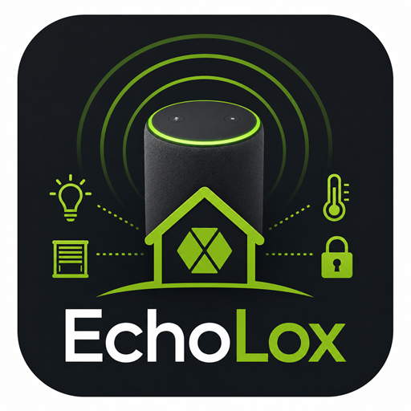

<div align="center">
  
  <h1>EchoLox</h1>
  <p><strong>LoxBerry Plugin</strong> — Philips Hue Bridge Emulator für Loxone &amp; Amazon Alexa</p>

  [](https://github.com/BattloXX/EchoLox/releases/latest)
  [](https://go.dev)
  [](https://www.loxberry.de)
  [](https://github.com/BattloXX/EchoLox/releases)
</div>

---

```
Alexa
  │  Hue-API  (Port 80 via Apache2-Proxy)
  ▼
EchoLox  (LoxBerry Plugin, Port 8079)
  │  HTTP GET  /dev/sps/io/{name}/{value}   (Basic Auth)
  │  oder UDP  {name}={value}\r\n
  ▼
Loxone Miniserver
  │  Virtual Inputs → Logik-Blöcke
  ▼
Echte Geräte  (Lampen, Rolläden, Szenen …)
```

Loxone bleibt die einzige Automations-Zentrale. EchoLox ist ausschliesslich die Brücke zwischen Alexa und Loxone.

---

## Inhaltsverzeichnis

- [Warum EchoLox?](#warum-echolox)
- [Voraussetzungen](#voraussetzungen)
- [Installation](#installation)
- [Erste Schritte](#erste-schritte)
- [Geräte anlegen](#geräte-anlegen)
- [Virtual Inputs in Loxone einrichten](#virtual-inputs-in-loxone-einrichten)
- [Alexa-Erkennung](#alexa-erkennung)
- [Sprachbefehle](#sprachbefehle)
- [Transports: HTTP, UDP, MQTT](#transports-http-udp-mqtt)
- [Status-Übersicht](#status-übersicht)
- [Backup & Restore](#backup--restore)
- [Logs & Diagnose](#logs--diagnose)
- [Import alter Konfiguration](#import-alter-konfiguration)
- [Einstellungen](#einstellungen)
- [Konfigurationsdatei](#konfigurationsdatei)
- [Automatische Updates (LoxBerry)](#automatische-updates-loxberry)
- [Technische Architektur](#technische-architektur)
- [Build & Cross-Compilation](#build--cross-compilation)
- [Troubleshooting](#troubleshooting)
- [FAQ](#faq)

---

## Warum EchoLox?

### Das Problem

Amazon Alexa kann nativ keine Loxone Virtual Inputs ansprechen. Die bisherige Lösung — ha-bridge (Java) — lief auf dem LoxBerry, verbrauchte aber 150–300 MB RAM und benötigte eine JVM.

### Die Lösung

EchoLox ist ein kompletter Neubau in **Go**:

| Kriterium | ha-bridge (Java) | EchoLox (Go) |
|---|---|---|
| RAM-Verbrauch | ~150–300 MB (JVM) | ~10–20 MB |
| Deployment | JAR + JRE | Einzelnes Binary, keine Deps |
| Startup-Zeit | 3–8 Sekunden | < 100 ms |
| ARM-Build | JRE muss installiert sein | `GOOS=linux GOARCH=arm64 go build` |
| Unterstützte Ziele | Vera, Fibaro, HASS, LIFX, … | Nur Loxone (gezielt, schlank) |

### Funktionsprinzip

Alexa erkennt EchoLox als echte Philips Hue Bridge (SSDP/UPnP-Discovery). Jedes Gerät, das du in EchoLox anlegst, erscheint in der Alexa-App als Hue-Lampe. Wenn du "Alexa, schalte Wohnzimmer Licht ein" sagst, sendet EchoLox einen HTTP-GET-Request an den Loxone Miniserver:

```
GET http://192.168.1.7/dev/sps/io/echolox_wohnzimmer_licht_on/1
Authorization: Basic base64(user:password)
```

---

## Voraussetzungen

| Komponente | Mindestversion |
|---|---|
| LoxBerry | 2.0 (Raspberry Pi oder x86) |
| Loxone Miniserver | beliebige Generation |
| Amazon Echo | beliebiges Modell |

> Echo und LoxBerry müssen im **gleichen Subnetz** sein — SSDP-Discovery funktioniert nicht über Router-Grenzen.

---

## Installation

### Über den LoxBerry Plugin Manager

1. LoxBerry Web-Oberfläche öffnen → **Plugin Manager**
2. **Plugin installieren** → **Von URL installieren**
3. ZIP-URL aus dem [GitHub Releases Tab](https://github.com/BattloXX/EchoLox/releases/latest) einfügen
4. Nach der Installation erscheint **EchoLox** in der LoxBerry Navigation
5. Der Dienst startet automatisch auf Port **8079**

Das Installations-Script richtet automatisch einen **Apache2-Proxy** für Port 80 ein (Alexa-Kompatibilität — siehe [Alexa-Erkennung](#alexa-erkennung)).

### Dienst prüfen

```
http://<loxberry-ip>:8079/description.xml
```
Erwartete Antwort: XML mit `Philips hue bridge 2015`.

---

## Erste Schritte

### 1. Miniserver-Verbindung prüfen

**EchoLox → Einstellungen** (`/echoloxui/settings.html`) öffnen.

- Miniserver wird automatisch aus der LoxBerry-Konfiguration gelesen — keine manuelle Eingabe nötig
- Dropdown: gewünschten Miniserver auswählen (bei mehreren konfigurierten)
- **Verbindung testen** → "Miniserver erreichbar"

### 2. Erstes Gerät anlegen

**EchoLox → Geräte → + Neu**:

- **Name:** `Wohnzimmer Licht` (exakt wie du es Alexa nennen wirst)
- **Typ:** `Dimmer`
- **Transport:** `HTTP`

Generierte Virtual Input Namen (werden sofort angezeigt):
- `echolox_wohnzimmer_licht_on`
- `echolox_wohnzimmer_licht_off`
- `echolox_wohnzimmer_licht_brightness`

### 3. Virtual Inputs in Loxone Config anlegen

Namen exakt wie oben:

| Virtual Input Name | Typ | Wert |
|---|---|---|
| `echolox_wohnzimmer_licht_on` | Virtual Input | 0/1 |
| `echolox_wohnzimmer_licht_off` | Virtual Input | 0/1 |
| `echolox_wohnzimmer_licht_brightness` | Virtual Input | 0–100 |

### 4. Alexa: Neue Geräte suchen

**"Alexa, suche nach neuen Geräten"** — oder Alexa-App → Geräte → + → Philips Hue.

---

## Geräte anlegen

### Gerätetypen

| Typ | Alexa-Befehle | Generierte Virtual Inputs |
|---|---|---|
| `switch` | Ein/Aus | `{name}_on`, `{name}_off` |
| `dimmer` | Ein/Aus, Helligkeit % | `{name}_on`, `{name}_off`, `{name}_brightness` |
| `color` | Ein/Aus, Helligkeit, Farbe | `{name}_on`, `{name}_off`, `{name}_brightness`, `{name}_hue`, `{name}_saturation` |
| `scene` | "Aktiviere …" | `{name}_activate` |

> Alle Namen haben automatisch das Prefix `echolox_`.

### Namensnormalisierung

| Eingabe | Prefix |
|---|---|
| `Wohnzimmer Licht` | `echolox_wohnzimmer_licht_` |
| `Küche Decke` | `echolox_kueche_decke_` |
| `Terrasse Süd` | `echolox_terrasse_sued_` |

Regeln: Kleinbuchstaben, Umlaute → ae/oe/ue/ss, Sonderzeichen → Unterstrich.

---

## Virtual Inputs in Loxone einrichten

### HTTP Virtual Input

Loxone Config → **Peripherie → Virtual Inputs → Virtual HTTP Input**:

1. Name: exakt wie von EchoLox generiert
2. HTTP-Methode: `GET`
3. URL-Pfad: `/dev/sps/io/{name}/{value}`

### UDP Virtual Input

Loxone Config → **Virtual UDP Input**:

- Port: `7777` (Standard, in EchoLox einstellbar)
- Format: `{name}={value}` (EchoLox sendet `echolox_wohnzimmer_licht_on=1\r\n`)

### Transport-Empfehlung

| Szenario | Transport |
|---|---|
| Zuverlässigkeit wichtig | **HTTP** — Antwort-Bestätigung, Basic Auth |
| Latenz < 5 ms | **UDP** — kein TCP-Handshake |
| Bereits MQTT Gateway im Einsatz | **MQTT** |

---

## Alexa-Erkennung

EchoLox emuliert eine Philips Hue Bridge Generation 2 (BSB002). Die Erkennung läuft über **SSDP/UPnP**:

1. Alexa sendet `M-SEARCH`-Broadcast (UDP Multicast `239.255.255.250:1900`)
2. EchoLox antwortet mit `HTTP/1.1 200 OK` (Unicast) und kündigt die Bridge via **SSDP NOTIFY** an
3. Alexa ruft `/description.xml` ab
4. Alexa verbindet sich mit der Hue-API und liest alle Geräte

### Port 80 — wichtig für neuere Alexa-Firmware

Alexa-Geräte mit Firmware ab 2019 erwarten die Hue Bridge zwingend auf **Port 80**. EchoLox läuft auf Port 8079; LoxBerry betreibt **Apache2** auf Port 80.

Das Installations-Script richtet automatisch einen **Apache2-Proxy** ein (`/etc/apache2/conf-available/echolox-hue.conf`):

```apache
ProxyPreserveHost On
# EchoLox Web-UI und Management-API
ProxyPass /echoloxui/ http://127.0.0.1:8079/echoloxui/
ProxyPassReverse /echoloxui/ http://127.0.0.1:8079/echoloxui/
ProxyPass /echolox/ http://127.0.0.1:8079/echolox/
ProxyPassReverse /echolox/ http://127.0.0.1:8079/echolox/
# Philips Hue API-Pfade für Alexa
ProxyPassMatch ^(/api(/.*)?|/description\.xml|/hue_logo[^/]*)$ http://127.0.0.1:8079$1
```

**Manuell einrichten** (falls Automatik fehlschlägt):

```bash
cat > /etc/apache2/conf-available/echolox-hue.conf << 'EOF'
ProxyPreserveHost On
ProxyPass /echoloxui/ http://127.0.0.1:8079/echoloxui/
ProxyPassReverse /echoloxui/ http://127.0.0.1:8079/echoloxui/
ProxyPass /echolox/ http://127.0.0.1:8079/echolox/
ProxyPassReverse /echolox/ http://127.0.0.1:8079/echolox/
ProxyPassMatch ^(/api(/.*)?|/description\.xml|/hue_logo[^/]*)$ http://127.0.0.1:8079$1
EOF

a2enmod proxy proxy_http
a2enconf echolox-hue
apache2ctl graceful
```

EchoLox verwendet ab Version 0.1.18 automatisch Port 80 als Discovery-Port (kein manuelles Setzen nötig).

### SSDP-Flow

```
Echo Device                    EchoLox (UDP :1900)
    │── M-SEARCH (Multicast) ──────▶│
    │◀── HTTP/1.1 200 OK (Unicast) ─│
    │      LOCATION: http://<ip>:80/description.xml
    │
    │── GET :80/description.xml ────▶│  (Apache2 → :8079)
    │◀── XML (Philips Hue Bridge) ───│
    │
    │── POST :80/api (pairing) ──────▶│
    │◀── {"success":{"username":…}} ─│
    │
    │── GET :80/api/{user}/lights ───▶│
    │◀── { "1": {…}, "2": {…} } ────│
```

---

## Sprachbefehle

| Befehl | Aktion |
|---|---|
| "Alexa, schalte [Name] ein" | `{name}_on = 1` |
| "Alexa, schalte [Name] aus" | `{name}_off = 1` |
| "Alexa, dimme [Name] auf 50 Prozent" | `{name}_brightness = 50` |
| "Alexa, stelle [Name] auf rot" | `{name}_hue = 0`, `{name}_saturation = 100` |
| "Alexa, aktiviere [Szenenname]" | `{name}_activate = 1` |

> Der Gerätename in EchoLox muss exakt so lauten, wie du ihn Alexa sagst.

---

## Transports: HTTP, UDP, MQTT

### HTTP (Standard)

```
GET http://<miniserver-ip>/dev/sps/io/<name>/<value>
Authorization: Basic base64(<user>:<password>)
```

Credentials und IP werden automatisch aus der LoxBerry-Konfiguration gelesen.

### UDP

```
echolox_wohnzimmer_licht_on=1\r\n
```

Port einstellbar (Standard: 7777). Kein Handshake — sehr geringe Latenz.

### MQTT

EchoLox publisht auf `loxone/{name}` mit dem Wert als Payload.

**Einstellungen:** Broker-URL, Benutzername und Passwort unter **EchoLox → Einstellungen**.

**MQTT Subscriptions (MQTT → Loxone):** Eingehende MQTT-Nachrichten können direkt an Virtual Inputs weitergeleitet werden. Konfiguration unter **Einstellungen → MQTT Subscriptions**:

| Feld | Beispiel | Beschreibung |
|---|---|---|
| Topic | `home/lights/wohnzimmer` | MQTT-Topic das abonniert wird |
| Ziel-VI | `echolox_wohnzimmer_licht_on` | Virtual Input der den Wert erhält |

Subscriptions werden in `$LBPDATADIR/mqtt_subscriptions.json` gespeichert.

---

## Status-Übersicht

**EchoLox → Status** (`/echoloxui/status.html`) — zeigt für jeden Virtual Input:

| Status | Bedeutung |
|---|---|
| `ok` | Letzter Send erfolgreich, VI im Miniserver gefunden |
| `not_found` | VI nicht gefunden — Namen in Loxone Config prüfen |
| `access_denied` | Credentials falsch — Passwort prüfen |
| `not_sent` | Noch kein Befehl seit Start gesendet |

---

## Backup & Restore

**EchoLox → Backup** (`/echoloxui/backup.html`) — sichert:

- `EchoLox.cfg` — alle Einstellungen
- `devices.json` — alle angelegten Geräte

| Funktion | Beschreibung |
|---|---|
| **Lokal speichern** | ZIP in `data/backup/` |
| **Herunterladen** | ZIP direkt im Browser |
| **Hochladen & Wiederherstellen** | Drag & Drop oder Dateiauswahl |
| **Lokalen Backup wiederherstellen** | Aus gespeicherter Liste wählen |

Nach Wiederherstellung EchoLox neu starten (**Einstellungen → Dienst neu starten**).

---

## Logs & Diagnose

**EchoLox → Logs** (`/echoloxui/logs.html`) — Ring-Buffer mit 2000 Einträgen + optionale Datei (`$LBPLOGDIR/EchoLox.log`).

| Level | Was wird geloggt |
|---|---|
| **INFO** (Standard) | Starts, M-SEARCH, Antworten, Fehler |
| **DEBUG** | Zusätzlich: jedes SSDP-Paket, API-Details |

### Log-API

```
GET  /echolox/api/logs             JSON-Array aller Einträge + aktueller Level
GET  /echolox/api/logs/download    Log-Datei als Textdatei
POST /echolox/api/logs/level       {"level": "debug"} oder {"level": "info"}
```

### Diagnose-Workflow (Alexa nicht gefunden)

1. **Debug aktivieren** → `/echoloxui/logs.html`
2. "Alexa, suche nach neuen Geräten" sagen
3. Log prüfen: `SSDP M-SEARCH` vorhanden?
4. Kein M-SEARCH → gleicher Subnetz? Firewall Port 1900?
5. M-SEARCH vorhanden, Alexa findet nichts → Apache2-Proxy prüfen, Discovery-Port 80?

---

## Import alter Konfiguration

Migration von ha-bridge:

1. **EchoLox → Import** öffnen
2. `devices.db` hochladen (Drag & Drop)
3. Vorschau prüfen → **Importieren**

> VI-Prefix ändert sich von `ha_` auf `echolox_` — Virtual Inputs in Loxone Config anpassen.

---

## Einstellungen

**EchoLox → Einstellungen** (`/echoloxui/settings.html`):

| Einstellung | Standard | Beschreibung |
|---|---|---|
| **Miniserver** | (aus LoxBerry) | Welcher Miniserver verwendet wird |
| **Transport** | HTTP | Übertragungsprotokoll |
| **UDP Port** | 7777 | Port für UDP-Transport |
| **EchoLox Port** | 8079 | Port auf dem EchoLox lauscht |
| **Discovery-Port** | 80 | Port in SSDP-LOCATION (0 = EchoLox-Port; 80 = Alexa-kompatibel) |
| **MQTT Broker** | tcp://localhost:1883 | Broker-URL |
| **MQTT Benutzername** | — | Optionaler MQTT-Benutzer |
| **MQTT Passwort** | — | Optionales MQTT-Passwort |

Port-Änderungen erfordern einen Neustart (**Dienst neu starten**).

---

## Konfigurationsdatei

Pfad: `/opt/loxberry/data/plugins/EchoLox/EchoLox.cfg`

```yaml
server:
  port: 8079           # Port auf dem EchoLox lauscht
  ip: ""               # leer = automatisch erkannt
  discovery_port: 80   # Port in SSDP-LOCATION (0 = wie port; 80 = Apache2-Proxy)

upnp:
  name: "EchoLox"

loxone:
  miniserver: "1"      # Miniserver-ID aus LoxBerry-Konfiguration
  transport: "http"    # http, udp oder mqtt
  udp_port: 7777

mqtt:
  broker: "tcp://localhost:1883"
  username: ""         # leer = kein Auth
  password: ""

data_dir: "/opt/loxberry/data/plugins/EchoLox"
```

Config und `devices.json` liegen beide im `data/`-Verzeichnis — dieses wird bei Plugin-Updates **nicht** überschrieben.

Miniserver-IP und Credentials werden automatisch aus `/opt/loxberry/config/system/general.json` gelesen.

---

## Automatische Updates (LoxBerry)

EchoLox unterstützt LoxBerrys eingebaute **Plugin-Autoupdate-Funktion**. Der Plugin Manager prüft regelmäßig [`release.cfg`](https://raw.githubusercontent.com/BattloXX/EchoLox/main/release.cfg) auf neue Versionen und meldet verfügbare Updates.

Die `release.cfg` wird bei jedem Release automatisch durch GitHub Actions aktualisiert.

---

## Technische Architektur

```
cmd/EchoLox/
    main.go                    # Entry point, CLI flags

internal/
    bridge/
        bridge.go              # HTTP-Server, Startup-Logik
        config.go              # YAML-Konfiguration
    hue/
        api.go                 # Philips Hue REST API v1.47.0
        state.go               # Brightness/Hue/Sat Konvertierung
    upnp/
        listener.go            # SSDP Multicast-Listener + NOTIFY
        socket_linux.go        # SO_REUSEPORT (Koexistenz mit LoxBerry ssdpd)
        socket_other.go        # Fallback für andere Plattformen
    device/
        model.go               # Device-Struct mit HueID
        manager.go             # CRUD, Persistenz, HueID-Vergabe
        naming.go              # Namensnormalisierung, VI-Generierung
        store.go               # JSON-Datei-Backend
    loxone/
        client.go              # HTTP/UDP/MQTT Send
        lbconfig.go            # LoxBerry general.json lesen
        verify.go              # VI-Status prüfen
        mqttbridge.go          # MQTT Subscription-Modell
    logbuf/
        logbuf.go              # Ring-Buffer Logger (INFO/DEBUG)
    api/
        handler.go             # REST API /echolox/api/*
    web/
        handler.go             # Statische Web-UI
    identity/
        identity.go            # Stabile Bridge-UUID aus IP
    migrate/
        importer.go            # ha-bridge devices.db Import

webembed/web/                  # Embedded Web-UI (Go embed.FS)
    index.html                 # Geräteliste
    device.html                # Gerät anlegen/bearbeiten
    status.html                # VI-Status
    settings.html              # Einstellungen + MQTT Subscriptions
    backup.html                # Backup & Restore
    logs.html                  # Log-Anzeige
    import.html                # ha-bridge Import
    assets/
        app.js  style.css  logo.png
```

### Hue API (implementierte Endpunkte)

```
GET  /description.xml
POST /api                          Pairing (immer erfolgreich)
GET  /api/{user}/lights            Alle Geräte
GET  /api/{user}/lights/{id}       Einzelnes Gerät
PUT  /api/{user}/lights/{id}/state Zustand setzen (on, bri, hue, sat)
GET  /api/{user}/groups            Gruppen (Group 0 = alle)
GET  /api/{user}/config            Bridge-Konfiguration
GET  /api/{user}/datastore         Vollständiger Datastore
```

### EchoLox Management API

```
GET/POST /echolox/api/settings               Einstellungen lesen/schreiben
GET/POST/PUT/DELETE /echolox/api/devices     Geräte-CRUD
GET/POST /echolox/api/mqtt/subscriptions     MQTT Subscriptions
DELETE   /echolox/api/mqtt/subscriptions     Subscription entfernen
POST     /echolox/api/restart                Dienst neu starten
GET/POST /echolox/api/backup                 Backup erstellen/auflisten
GET      /echolox/api/backup/download        Backup herunterladen
POST     /echolox/api/backup/restore         Backup wiederherstellen
GET/POST /echolox/api/logs                   Logs abrufen/Level setzen
```

---

## Build & Cross-Compilation

```bash
# Voraussetzungen: Go 1.22+

# Lokaler Build (für Entwicklung)
go build ./cmd/EchoLox/
./EchoLox --config ./data/EchoLox.cfg
# Web-UI: http://localhost:8079/echoloxui/

# Alle Zielplattformen
make all
# oder manuell:
GOOS=linux GOARCH=arm64       go build -o bin/EchoLox-arm64 ./cmd/EchoLox
GOOS=linux GOARCH=arm GOARM=7 go build -o bin/EchoLox-armv7 ./cmd/EchoLox
GOOS=linux GOARCH=amd64       go build -o bin/EchoLox-amd64  ./cmd/EchoLox
```

### CI/CD (GitHub Actions)

| Trigger | Ergebnis |
|---|---|
| Push auf `main` | Stabiles Release (automatische Patch-Version) |
| `workflow_dispatch` mit `prerelease=true` | GitHub Prerelease |

```bash
# Prerelease manuell erstellen:
gh workflow run release.yml --field prerelease=true
```

---

## Troubleshooting

### Alexa findet die Bridge nicht

Prüfpunkte in dieser Reihenfolge:

**1. Debug-Logs aktivieren**
`/echoloxui/logs.html` → Debug aktivieren → "Alexa, suche Geräte" → `SSDP M-SEARCH` im Log vorhanden?

**2. description.xml erreichbar?**
```
http://<loxberry-ip>:80/description.xml    # via Apache2-Proxy
http://<loxberry-ip>:8079/description.xml  # direkt
```
Erwartete Antwort: XML mit `Philips hue bridge 2015`.

**3. Discovery-Port korrekt?** (Einstellungen → Discovery-Port)
- `80`: Apache2-Proxy muss laufen
- `0` / `8079`: Alexa (neue Firmware) findet Bridge möglicherweise nicht

**4. Apache2-Proxy Status** — Installationslog:
```
<OK> EchoLox Apache2 proxy configured (port 80 -> 8079 for Hue API + UI)
```

**5. Gleicher Subnetz?** Echo und LoxBerry müssen im selben Subnetz sein.

**6. Firewall?**
```bash
iptables -A INPUT -p udp --dport 1900 -j ACCEPT
```

**7. Port 1900 belegt?**
```bash
ss -ulnp | grep 1900
```
EchoLox nutzt `SO_REUSEPORT` — kann Port 1900 **gleichzeitig** mit LoxBerrys `ssdpd` verwenden. Kein Konflikt, kein Stoppen nötig.

EchoLox sendet beim Start einen NOTIFY-Burst und danach alle **120 Sekunden** erneut. Alexa findet die Bridge also spätestens nach 2 Minuten, auch nach einem Reboot.

---

### Alexa erkennt Geräte, Befehle kommen nicht an

1. **Testen-Button** in Geräteliste → sendet direkt an Miniserver
2. **Status-Seite**: `not_found` → VI-Namen in Loxone Config prüfen
3. **Verbindungstest** in Einstellungen → Credentials prüfen

---

### EchoLox startet nicht

```bash
systemctl status echolox.service
journalctl -u echolox.service -n 50

# Manuell starten (Logs direkt sehen):
LBHOMEDIR=/opt/loxberry \
  /opt/loxberry/bin/plugins/EchoLox/EchoLox \
  --config /opt/loxberry/data/plugins/EchoLox/EchoLox.cfg
```

---

### Geräte nach Update weg

`devices.json` liegt in `/opt/loxberry/data/plugins/EchoLox/` — wird bei Updates **nicht** gelöscht. Zusätzlich sichert das Update-Script `devices.json` vor dem Update automatisch nach `/tmp/EchoLox_devices.bak` und stellt sie danach wieder her.

Manuell wiederherstellen:
```bash
cp /tmp/EchoLox_devices.bak /opt/loxberry/data/plugins/EchoLox/devices.json
systemctl restart echolox.service
```

---

## FAQ

**Kann ich mehrere Echo-Geräte verwenden?**
Ja. Alle Echos im gleichen Netzwerk finden die Bridge automatisch.

**Was passiert wenn EchoLox nicht läuft?**
Alexa meldet "Gerät nicht erreichbar". Loxone selbst läuft unabhängig weiter.

**Kann ich EchoLox ohne LoxBerry verwenden?**
Ja, als Standalone-Binary. Miniserver-Credentials manuell in `EchoLox.cfg` eintragen. Wenn EchoLox direkt auf Port 80 läuft (mit `CAP_NET_BIND_SERVICE`), ist kein Apache2-Proxy nötig.

**Warum Port 80 statt direkt 8079?**
Neuere Alexa-Firmware ignoriert SSDP-Antworten mit nicht-Standard-Ports. Der Apache2-Proxy leitet Hue-API-Pfade transparent weiter, ohne andere LoxBerry-Funktionen zu beeinflussen.

**Wird HTTPS unterstützt?**
Nein. Die Hue-API funktioniert nur über HTTP (wie die echte Bridge).

**Wie viele Geräte werden unterstützt?**
Theoretisch unbegrenzt. Alexa hat ein Limit von ca. 300 Hue-Lampen pro Bridge.

**Alexa-Geräte verschwinden nach Neustart?**
Die Bridge-UUID wird aus der LoxBerry-IP berechnet und bleibt stabil. Falls nötig: "Alexa, suche nach neuen Geräten".

---

## Sicherheit

EchoLox ist für den Betrieb im **lokalen Netzwerk** ausgelegt. Kein HTTPS, keine Authentifizierung an der Hue-API (wie die echte Bridge). Nicht aus dem Internet erreichbar machen.

---

<div align="center">
  <sub><em>EchoLox — <a href="https://github.com/BattloXX/EchoLox">github.com/BattloXX/EchoLox</a></em></sub>
</div>
